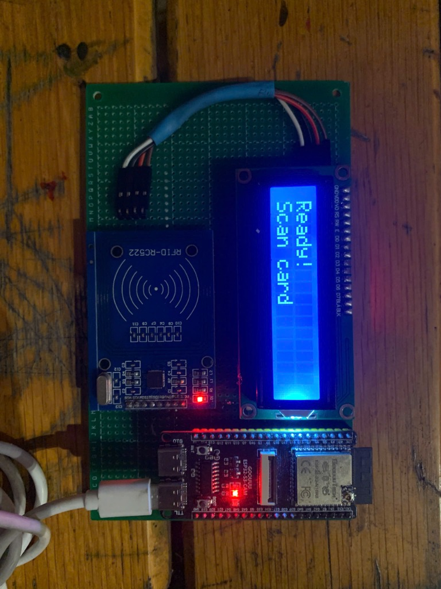
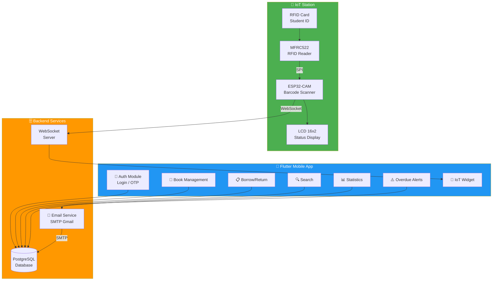

<div align="center">

# 📚 Smart Library System
### Hệ Thống Quản Lý Thư Viện Thông Minh

[](https://flutter.dev/)
[](https://dart.dev/)
[](https://postgresql.org/)
[](https://bloclibrary.dev/)
[](https://www.espressif.com/)

**Ứng dụng quản lý thư viện Full-Stack (Flutter + PostgreSQL) tích hợp IoT — trạm quét thẻ RFID và barcode tự động bằng ESP32-CAM.**

**Full-Stack Library Management App (Flutter + PostgreSQL) with IoT integration — automated RFID card & barcode scanning station powered by ESP32-CAM.**

</div>

---

## 📸 Demo

<!-- 
🔽 THÊM HÌNH ẢNH / VIDEO DEMO TẠI ĐÂY 🔽
Ví dụ:


-->

> ⚠️ *Vui lòng thêm ảnh/video demo ứng dụng và trạm IoT tại đây.*
>
> ⚠️ *Please add app & IoT station demo images/videos here.*

---

## 📐 System Architecture / Kiến Trúc Hệ Thống



---

## 🛠️ Tech Stack / Công Nghệ

| Layer | Technology |
|-------|-----------|
| **Frontend** |   |
| **State Management** |  |
| **DI** |  |
| **Database** |  |
| **Email** |  |
| **IoT Firmware** |   |
| **Architecture** |  |

---

## ⚡ Key Features & Metrics / Tính Năng & Chỉ Số

| Feature | Metric |
|---------|--------|
| 📖 **Quản lý sách** / Book Management | CRUD đầy đủ, tìm kiếm theo tên/tác giả/thể loại, quản lý **10,000+** đầu sách |
| 🔐 **Phân quyền 3 cấp** / Role-based Access | **Admin** → **Librarian** → **Member** với xác thực OTP qua email |
| 📋 **Mượn/Trả sách** / Borrow/Return | Tạo phiếu, tự động tính phí phạt quá hạn, theo dõi lịch sử |
| ⚠️ **Cảnh báo quá hạn** / Overdue Alerts | Tự động gửi email vào **8:00 AM** hàng ngày (0-3 ngày trước hạn + quá hạn) |
| 📊 **Báo cáo PDF** / PDF Reports | Xuất thống kê sách mượn nhiều nhất, số lượng sách/người dùng |
| 🤖 **IoT tự động** / IoT Automation | Quét thẻ RFID + barcode sách → tự động điền form mượn trên app |
| 🖥️ **LCD Real-time** / Real-time Display | Hiển thị thông tin sinh viên & sách trên LCD 16x2 qua WebSocket |
| 🏗️ **Clean Architecture** | Data → Domain → Presentation, mỗi feature module độc lập |

---

## 🔌 Hardware Setup (IoT Station) / Phần Cứng Trạm IoT

### Pinout Table / Bảng Nối Chân

| Component | Pin / Signal | ESP32-CAM GPIO |
|-----------|-------------|----------------|
| **MFRC522 (RFID)** | SDA (SS) | `GPIO 12` |
| | RST | `GPIO 16` |
| | MOSI | `GPIO 13` |
| | MISO | `GPIO 15` |
| | SCK | `GPIO 14` |
| **LCD 16x2** | SDA | `GPIO 2` (I2C) |
| | SCL | `GPIO 3` (I2C) |
| **Camera** | Built-in OV2640 | ESP32-CAM onboard |

> 💡 **Note:** ESP32-CAM sử dụng camera onboard để quét barcode sách — không cần module scanner rời.

---

## 🚀 How to Run / Hướng Dẫn Chạy

### 1. Prerequisites / Yêu cầu

```
• Flutter SDK >= 3.0.0
• Dart SDK >= 3.0.0
• PostgreSQL (database đã cấu hình sẵn trên cloud)
• Android Studio / VS Code
• Android Emulator hoặc thiết bị thật
```

### 2. Installation / Cài đặt

```bash
# Clone repository
git clone https://github.com/duc2512/Smart-Library-System.git
cd Smart-Library-System

# Cài đặt dependencies / Install dependencies
flutter pub get

# Chạy ứng dụng / Run the app
flutter run
```

### 3. Khởi chạy toàn bộ dịch vụ / Start all services

```powershell
# PowerShell
.\start_all_services.ps1

# CMD
start_all_services.bat

# Dừng / Stop
.\stop_all_services.ps1
```

### 4. Tài khoản mặc định / Default accounts

| Role | Username | Password |
|------|----------|----------|
| Admin | `admin` | `admin123` |
| Librarian | `librarian` | `admin123` |
| Member | `user` | `user123` |

---

## 📁 Project Structure / Cấu Trúc Dự Án

```
Smart-Library-System/
├── lib/
│   ├── config/                    # ⚙️ App configuration
│   │   ├── database/              # Database connection
│   │   ├── injection/             # DI (GetIt + Injectable)
│   │   ├── routes/                # App navigation
│   │   └── themes/                # Light / Dark themes
│   │
│   ├── features/                  # 📦 Feature modules (Clean Architecture)
│   │   ├── auth/                  # 🔐 Login, forgot password, OTP
│   │   ├── iot/                   # 🤖 IoT station (WebSocket, BLoC)
│   │   ├── dashboard/             # 📊 Statistics overview
│   │   ├── duc_search_functionality/ # 🔍 Book search
│   │   ├── tuan_borrow_management/   # 📋 Borrow/return management
│   │   ├── tung_overdue_alerts/      # ⚠️ Overdue email alerts
│   │   ├── statistics_reports/       # 📈 PDF reports
│   │   └── user_management/          # 👥 User CRUD
│   │
│   ├── shared/                    # 🔧 Shared components
│   │   ├── database/              # PostgreSQL helper
│   │   ├── models/                # User, Book, BorrowCard
│   │   ├── services/              # Email, Notification
│   │   └── widgets/               # Reusable UI components
│   │
│   └── main.dart                  # 🚀 Entry point
│
├── database/
│   └── setup_postgres.sql         # 📄 SQL schema + sample data
│
├── features/iot/                  # 🤖 IoT Station (ESP32-CAM)
│   ├── esp32_firmware/            # C++ firmware (PlatformIO)
│   ├── README.md                  # IoT documentation
│   └── QUICK_START.md             # 10-minute setup guide
│
└── start_all_services.ps1         # ▶️ Launch script
```

---

## 👤 Author

**Le Tho Duc** — [GitHub @duc2512](https://github.com/duc2512)

---

<div align="center">
⭐ If you find this project useful, please give it a star! ⭐
</div>
